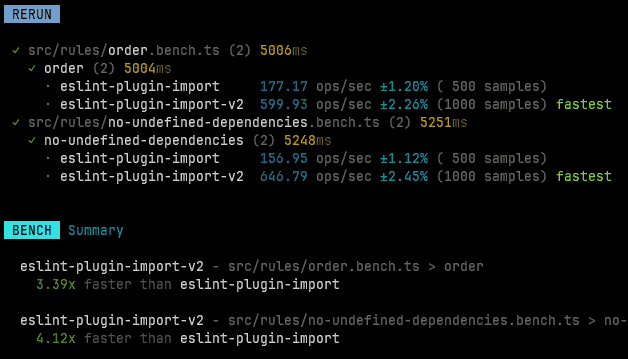

# eslint-plugin-import-v2

<!--

-->

This is a WIP experiment to create a new version of `eslint-plugin-import` that is faster and smaller.

I will probably just add rules that I use and probably stop before being done.

Benchmarks:

Install sizes:

`eslint-plugin-import`: 5.38MB
`eslint-plugin-import-v2`: 245.93KB
